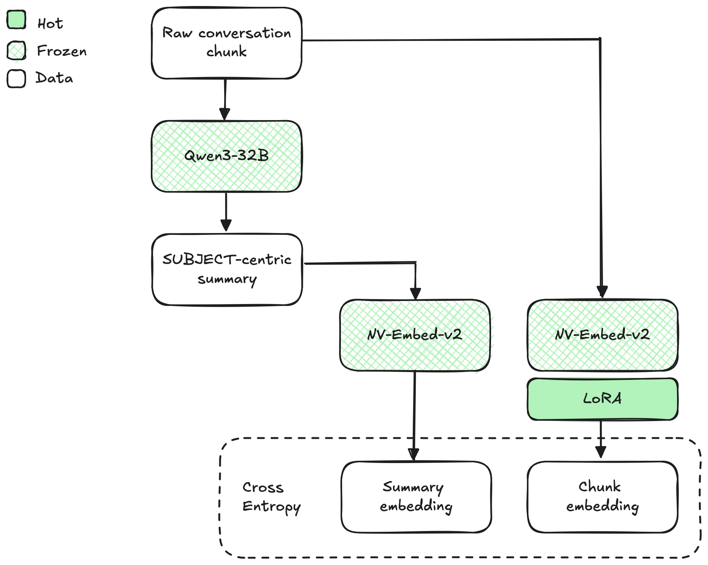
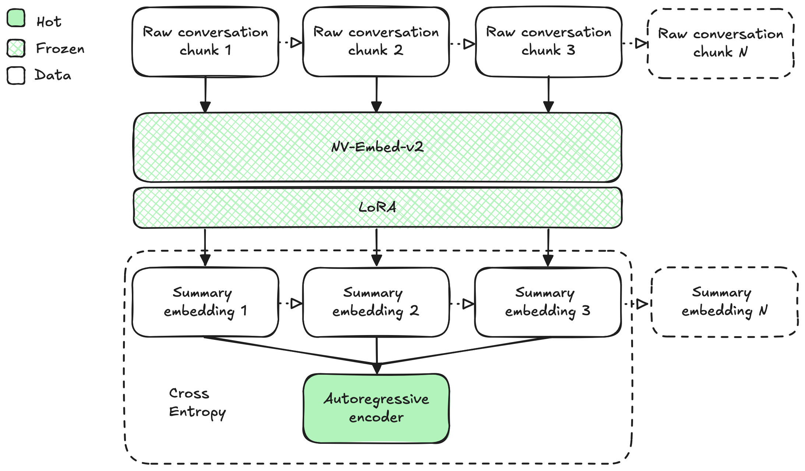
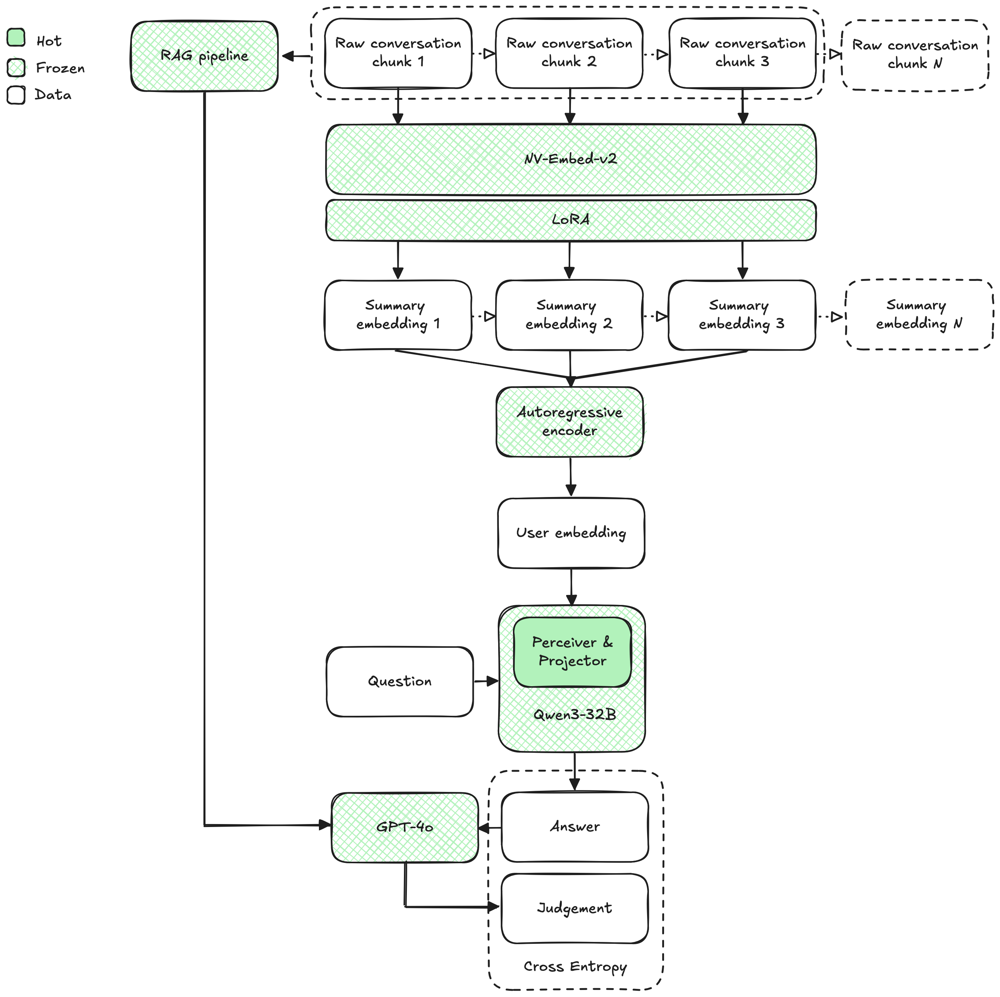

# Training User-LLM (Efficient LLM Contextualization with User Embeddings) on Vana's DataDAOs Conversational Dataset

This project aims to leverage Vana's DataDAOs private conversational datasets (Reddit, Telegram, ChatGPT) to outperform public alternatives (e.g., Reddit/Twitter PushShift). We produce two artifacts: a universal user-embedding model (for recall tasks) and an LLM personalization system (for precision tasks), showcasing the dataset's value at different personalization stages.

## Project Goals
- **Unified Model Across Users**:
    - Compare datasets at aggregate level
    - Bootstrap personalization even with sparse user data
    - Cheap updates by encoding new data points
- **Efficient Long-Term History Compression**: Current personalization approaches rely on limited RAG methods to avoid attention bottlenecks, neglecting valuable long-term and implicit user signals.
- **Bias-Free Reasoning**: Prevent user personality biases from affecting the LLM's reasoning process (differently from LoRA-based methods).
- **Staged Training Approach**:
    - **Parameter Interpretability**: Simplify manual reasoning about parameters without complex Bayesian optimization
    - **Modular Artifacts**: Support producing both user embeddings and flexible personalization systems, not a single monolithic model
    - **Optimized Data Funnel**: Tiered data requirements make the project more manageable and cost-effective: millions of samples for early stages, scaling down to tens of thousands for final expensive reward evaluation stages. 

### Core Incremental Contributions
Building on User-LLM, our incremental contributions include:

- **Conversation Chunk Encoder**: Implement an encoder trained via distillation on subject-focused conversation summaries, using chat threads instead of traditional user-item interactions. 
- **Flexible Task Goaling**: Beyond next-item prediction, we focus on generating diverse user insights validated through agentic-RAG and context-stuffing.
- **Production-Grade Operationalization**:
    - Evaluate using state-of-the-art base encoder and decoder
    - Evaluate at exponentially increasing sequence embedding dimensions

## Methodology

### Staged Training Pipeline
The training pipeline comprises three independently trained components:

#### 1. Item Encoder
<!--
Diagram 1  –  Contrastive alignment of chunk-vs-summary embeddings
--------------------------------------------------------------
* **Raw conversation chunk** → frozen **Qwen3-32B** → SUBJECT-centric summary.
* Two parallel, frozen **NV-Embed-v2** encoders:
  – **Summary path** embeds the summary → "summary embedding".  
  – **Chunk path** embeds the original chunk but adds a trainable **LoRA** adapter → "chunk embedding".
* A contrastive cross-entropy loss pulls the chunk embedding toward its own summary embedding.
* Only the LoRA is updated; every large model stays frozen.
-->


We fine-tune the text encoder via distillation from Qwen3-32B, capturing SUBJECT-centric contributions from conversation chunks. The summarization prompts are optimized via automated prompt refinement like DSPy.

**Hard negative mining**: As they do in the Gecko paper, we might have to use an LLM to sample hard negatives so that similar contributions from different users are not pulled apart. To illustrate the problem, consider the following two chunks:

```
# Chunk 1
{ 
    "user": "Alice", 
    "text": "I'm going to the store to buy some groceries.", 
    "replies": [
        { 
            "user": "Bob", 
            "text": "Cool, can I come with you?", 
            "replies": [
                {
                    "user": "Charlie", # Masked as SUBJECT in pre-processing
                    "text": "Can you buy me some fruits?"
                }
            ] 
        }
    ] 
}

# Chunk 2
{ 
    "user": "Dave", 
    "text": "I'm going out for a walk.", 
    "replies": [
        { 
            "user": "Eve", # Masked as SUBJECT in pre-processing
            "text": "If you pass by the store, can you buy me some fruits?" 
        }
    ] 
}
```

The two chunks are very similar and their summaries should both be something along the lines of "SUBJECT is asking for a favor, to buy fruits, to someone who's going to the store".

Random negative mining will pull the chunk embedding of Chunk 1 away from the summary embedding of Chunk 2, but they should actually be close together because both chunks would be semantically the same from the perspective of the SUBJECT.

**Loss function**: InfoNCE with frozen targets.

#### 2. Sequence Encoder
<!--
Diagram 2  –  Sequence-level pre-training of an autoregressive encoder
--------------------------------------------------------------------
* A stream of chunks (1…N) runs through the same **NV-Embed-v2 + LoRA** encoder, yielding a sequence of summary embeddings.
* A trainable **autoregressive encoder** (GPT-style) predicts the next summary embedding from the previous ones.
* Cross-entropy loss trains the autoregressive weights (and optionally the LoRA) to model a user's conversation history as an ordered series.
* Outcome: a lightweight recurrent model that compresses many summaries into a single, context-aware "user state" vector.
-->


The autoregressive encoder compresses noisy user histories, surfacing predictive signals like Knowledge, Opinions, Attributes, Intents (KOAIs).

**Note**: Non-predictive KOAIs explicitly stated by SUBJECTs may be ignored intentionally (which might actually be desirable: POSIWID). For potentially predictive KOAIs at the end of the sequence we should anyway rely on RAG at test time, as per original findings.

**Loss function**: Contrastive Predictive Coding InfoNCE: Here we compare the sequence embedding to positive and negative samples; need to train a projector too since they live in different spaces. (like in original paper, see 3.3)
$$
\mathcal{L}_t = -\log
\frac{
  \exp(\mathrm{sim}(c_t, z_{t+1}) / \tau)
}{
  \exp(\mathrm{sim}(c_t, z_{t+1}) / \tau)
  + \displaystyle\sum_{j=1}^{K-1} \exp(\mathrm{sim}(c_t, z_j^-) / \tau)
}
$$

$$
\begin{aligned}
c_t &= f_{\mathrm{AR}}(z_{1:t}) & \text{context representation at time }t,\\
z_{t+1} & & \text{positive sample: the next snippet's embedding},\\
\{z_j^-\}_{j=1}^{K-1} & & \text{negative samples: other snippet embeddings},\\
\mathrm{sim}(u,v) &= \frac{u^\top v}{\|u\|\|v\|} & \text{similarity (e.g. cosine or dot product)},\\
\tau &> 0 & \text{temperature hyperparameter},\\
K & & \text{total number of samples (1 positive + $K-1$ negatives).}
\end{aligned}
$$


#### 3. Perceiver & Projector
<!--
Diagram 3  –  End-to-end question-answering with user embedding & RAG
--------------------------------------------------------------------
1. A **RAG pipeline** selects the relevant conversation chunks.
2. Chunks → **NV-Embed-v2 + LoRA** → summary embeddings → **autoregressive encoder** → single **user embedding**.
3. A small **Perceiver + Projector** injects that user embedding into **Qwen3-32B** along with the current **question**.
4. Qwen3-32B produces an **answer**.
5. A frozen **GPT-4o** critic scores the answer; its judgment drives a loss that fine-tunes only the lightweight adapters (LoRA, Perceiver/Projector, autoregressive encoder).
Result: personalised answers with minimal trainable parameters while the large foundation models remain frozen.
-->


Here we train the perceiver for cross-attention, optimizing for diverse user prediction tasks evaluated by a high-quality, context-stuffed judge model.

## Project Structure

```
.
├── data/ # Not tracked, contains artifacts
├── src/
│   └── user_embeddings/ # Code common to scripts and notebooks
├── notebooks/
└── scripts/
    └── data_preparation/
    └── evaluation/
```
## Limitations & Future Work

- Implement DSPy for prompt refinement (and program synthesis when available)
- Tune chunk embedder to KOAIs instead of summaries for interpretable semantic separation of user data (and potentially better prediction performance)
- Experiment with alternative goals for the autoencoder

## Getting Started
TODO

## Usage
TODO